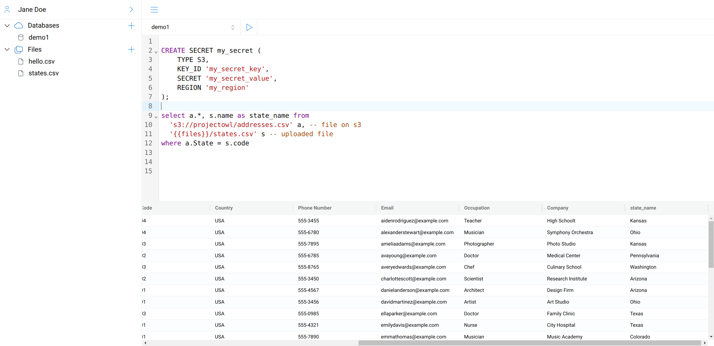

# OwlApp

Web based SQL query editor for your files, databases and cloud storage data.

Currently you can use it to query:
- Local files
- Cloud Storage Files (gcs, s3)
- Postgresql Database
- Duckdb Database

- You can create multiple users and each user can manage their user space (databases, connections, etc..)
- Has builtin user authentication and google oauth support.

- You can also upload files and query them.

## Installation

```sh
# Requires python >=3.12
pip install owlapp
```

## Quick Start

Start with basic options.

```sh
# create a directory in your favorite place like ~/projects/owlapp
mkdir ~/projects/owlapp && cd ~/projects/owlapp

# Create a virtual environment
python -m venv .venv && source .venv/bin/activate

# Install owlapp
pip install owlapp

# Initialize it with basic settings
owl init all

# Run it
owl run
```

- Run the following command see command line usage.

```sh
owl --help
```




See `.env` file for configuration options.


